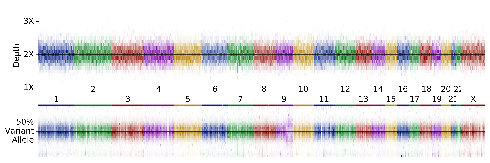

# 1000 genomes uniparental isodisomy identification
* These samples were mostly identified with a semi-automated pipeline, backed up by manual curation 
* A more robust pipeline is in the works, but we are including these as they are good examples for testing. This may not be a comprehensive list of UPDs and mosaic UPDs in this cohort. 

### NA12874 -- large single ROH on 1q, presumably UPD

### NA19462 -- mosaic UPD on 1p

### HG00110 -- mosaic UPD on 5q

### NA19788 -- mosaic UPD on 9q

### NA20282 -- mosaic UPD on 3q

