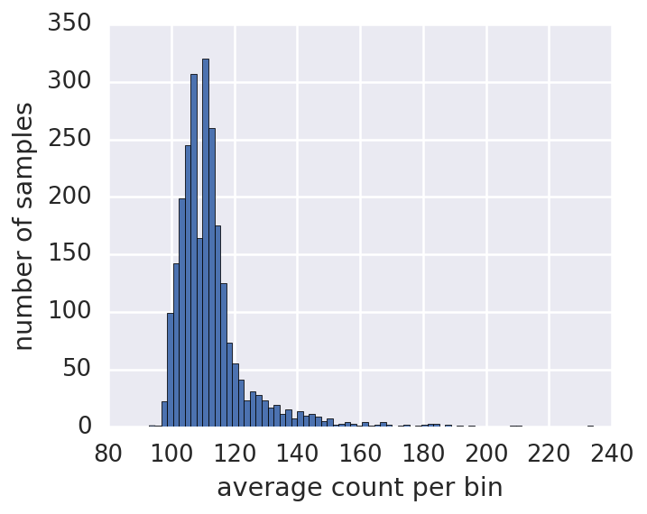
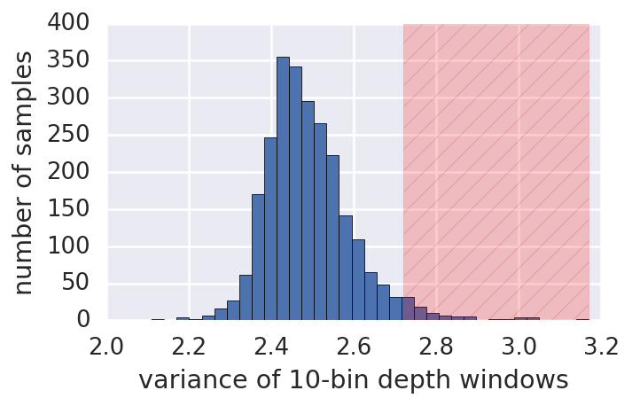

<h2>Sample metadata</h2>

### Genome-wide coverage   
* This is the genome-wide coverage in the framework of our CNV calling pipeline. In this sense it is not strictly read based coverage, but rather the average number of reads that fall into our 1kb depth bins. 
* The methods here follow from Canvas CNV calling depth binning convention, updated to fit within the (very similar) Dragen CNV calling paradigm. For a detailed description of the Canvas depth binning method see Section 5.1 of the software design description ([link](https://github.com/Illumina/canvas/raw/master/SoftwareDesignDescription.pdf)).  

__file:__ [data/average_count_per_bin.csv](./data/average_count_per_bin.csv])

<h8>begining of file: </h8>

    sample
    HG00096    114
    HG00097    109
    HG00099    127
    HG00100    106
    HG00101    114
    Name: average count per bin, dtype: int64

<h8>distribution of data: </h8>

### Quantification of replication timing and GC bias
* In our standard normalization pipeline we do a GC bias adjustment, while when dealing with cell lines we add in an additional adjusment for differences in replication timing across the genome. 
* Shown here is the average absolute value of change in the depth value before and after each of these adjustments. These metrics give us an idea of the magnatude of each of these biases in the samples. 
* For cell lines the replication adjustment happens after GC adjustment, so we record the change after each adjusment (GC-raw, and rep-GC) as well as after both adjustments (rep-raw).  

__file:__ [data/bias_adjustment_pct_changed.csv](./data/bias_adjustment_pct_changed.csv])

<h8>begining of file: </h8>

<table border="0" class="dataframe">
  <thead>
    <tr style="text-align: right;">
      <th></th>
      <th>GC-raw</th>
      <th>rep-GC</th>
      <th>rep-raw</th>
    </tr>
  </thead>
  <tbody>
    <tr>
      <th>HG00096</th>
      <td>0.020</td>
      <td>0.018</td>
      <td>0.027</td>
    </tr>
    <tr>
      <th>HG00097</th>
      <td>0.024</td>
      <td>0.027</td>
      <td>0.038</td>
    </tr>
    <tr>
      <th>HG00099</th>
      <td>0.023</td>
      <td>0.032</td>
      <td>0.040</td>
    </tr>
    <tr>
      <th>HG00100</th>
      <td>0.018</td>
      <td>0.019</td>
      <td>0.026</td>
    </tr>
    <tr>
      <th>HG00101</th>
      <td>0.024</td>
      <td>0.019</td>
      <td>0.029</td>
    </tr>
  </tbody>
</table>

### Quantification of depth variance
* One key metric we use for quantification of data quality for CNV pipelines is the variance in our depth of coverage. 
* We calculate this as the median-absolute-deviation of normalized, binned depth data across various length scales. 
* The 1-bin variance is simply the variance of the depth bin data, the 10 and 100 bin variance are the variance of larger length window (roughly 10kb and 100kb, respectively). These larger windows better model noise in CNV calling that is likely to cause false positive and false negitive calls, as these represent more systematic (as opposed to random) variance.  
* This variance metadata is shown for depth after normalization and GC adjustment, with and without the additional adjustment for genome-wide replication timing trends. 

__file:__ [data/depth_variance.csv](./data/depth_variance.csv])

<h8>begining of file: </h8>

<table border="0" class="dataframe">
  <thead>
    <tr>
      <th>adjustment-type</th>
      <th colspan="3" halign="left">GC</th>
      <th colspan="3" halign="left">GC+replication</th>
    </tr>
    <tr>
      <th>window-size (# of bins)</th>
      <th>1</th>
      <th>10</th>
      <th>100</th>
      <th>1</th>
      <th>10</th>
      <th>100</th>
    </tr>
  </thead>
  <tbody>
    <tr>
      <th>HG00096</th>
      <td>7.46</td>
      <td>2.81</td>
      <td>1.85</td>
      <td>7.36</td>
      <td>2.40</td>
      <td>1.04</td>
    </tr>
    <tr>
      <th>HG00097</th>
      <td>7.69</td>
      <td>3.28</td>
      <td>2.51</td>
      <td>7.49</td>
      <td>2.53</td>
      <td>1.22</td>
    </tr>
    <tr>
      <th>HG00099</th>
      <td>7.59</td>
      <td>3.64</td>
      <td>3.02</td>
      <td>7.26</td>
      <td>2.56</td>
      <td>1.38</td>
    </tr>
    <tr>
      <th>HG00100</th>
      <td>7.55</td>
      <td>2.80</td>
      <td>1.81</td>
      <td>7.47</td>
      <td>2.41</td>
      <td>1.01</td>
    </tr>
    <tr>
      <th>HG00101</th>
      <td>7.47</td>
      <td>2.82</td>
      <td>1.87</td>
      <td>7.37</td>
      <td>2.41</td>
      <td>1.07</td>
    </tr>
  </tbody>
</table>

<h8>92 samples are filtered at a z-score=3 cutoff.</h8>

<h8>List of filtered samples.</h8>

    HG00111  HG00313  HG00327  HG00335  HG00732  HG01113  HG01133  HG01137  
    HG01259  HG01272  HG01303  HG01308  HG01359  HG01495  HG01551  HG01631  
    HG01702  HG01705  HG01761  HG01850  HG01873  HG01917  HG01961  HG01977  
    HG01980  HG02054  HG02086  HG02144  HG02450  HG02651  HG02652  HG02808  
    HG02810  HG02811  HG02816  HG02817  HG02819  HG02839  HG02947  HG03055  
    HG03077  HG03401  HG03428  HG03634  HG03643  HG03644  HG03713  HG03796  
    HG03884  NA12006  NA12749  NA12777  NA12814  NA18520  NA18946  NA19080  
    NA19113  NA19372  NA19472  NA19473  NA19655  NA19747  NA20274  NA20532  
    NA20534  NA20535  NA20581  NA20786  NA20803  NA20826  NA20828  NA20846  
    NA20875  NA20886  NA20888  NA20903  NA21089  NA21111  NA21116  NA21118  
    NA21120  NA21127  

