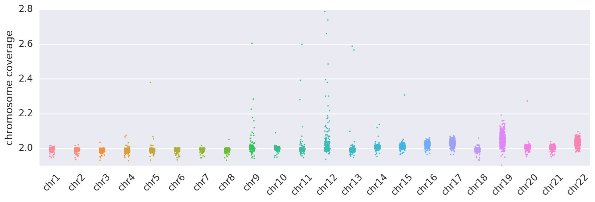

## Whole chromosome level coverage
* This is the per-chromosome coverage as calculated with our CNV depth binning approach.  
* Power to detect chromosome-wide events varies per chromosome, but in general we are fairly well powered to detect events at greater than 5-10% purity with no additional modeling. 
* From the below plot, it can be seen that some chromosomes are a bit noisier than others, particularly chr9, chr12, and chr19. When calling mosaic trisomy events, we account for the baseline noise and variance across the population.

__file:__ [data/chromosome_coverage.csv](./data/chromosome_coverage.csv)

<i>*shown here with values doubled, such that a value of 2 represents the expected coverage for a normal diploid segment</i>

## Karyotype-band level coverage
* Here we break down coverage by karyotype band, with coordinates obtained from the UCSC table browser.  
* We look at this data for two major reasons: 
    * We want to distinguish whole chromosome mosaic events, from large CNVs of higher purity. To do this, we need finer resolution data to understand if an event covers the full chromosome or just part of it.  
    * We want to identify large CNVs covering multiple chromosome bands. These are unlikly to be in the germline of these presumably healthy individuals, so we will flag these as well to 1) use as test cases mimicking pathogenic variants and 2) exclude these individuals from background calculations.  

There are two main files here, one with per-band coverage across each sample, and a second with consecutive bands with normal or anamolous coverage merged using a rough segmentation method. 
* __band x sample file:__ [data/band_stats.csv.gz](./data/band_stats.csv.gz) 
* __merged-band file:__ [data/chrom_stats.csv.gz](./data/chrom_stats.csv.gz)

28 samples with full chromosome alteration:   

    HG00142  HG00189  HG00623  HG01137  HG01303  HG01357  HG01414  HG01506  
    HG01602  HG01702  HG01704  HG02322  HG02409  HG02485  HG02634  HG02651  
    HG02652  HG02805  HG03118  HG03796  HG03940  HG04198  HG04227  NA12156  
    NA19378  NA20348  NA20759  NA21143  

chromosomes with trisomies: 
<table border="0" class="dataframe">
  <thead>
    <tr style="text-align: right;">
      <th></th>
      <th></th>
      <th>median</th>
      <th>mad</th>
      <th>z-score</th>
    </tr>
    <tr>
      <th>subject</th>
      <th>CHROM</th>
      <th></th>
      <th></th>
      <th></th>
    </tr>
  </thead>
  <tbody>
    <tr>
      <th rowspan="2" valign="top">HG00142</th>
      <th>chr11</th>
      <td>130.4</td>
      <td>9.6</td>
      <td>169.4</td>
    </tr>
    <tr>
      <th>chr13</th>
      <td>129.6</td>
      <td>9.7</td>
      <td>144.9</td>
    </tr>
    <tr>
      <th>HG00189</th>
      <th>chr9</th>
      <td>111.6</td>
      <td>9.1</td>
      <td>47.2</td>
    </tr>
    <tr>
      <th>HG00623</th>
      <th>chr12</th>
      <td>133.3</td>
      <td>9.5</td>
      <td>84.7</td>
    </tr>
    <tr>
      <th>HG01137</th>
      <th>chr12</th>
      <td>115.4</td>
      <td>9.0</td>
      <td>39.0</td>
    </tr>
    <tr>
      <th rowspan="2" valign="top">HG01303</th>
      <th>chr12</th>
      <td>119.1</td>
      <td>9.3</td>
      <td>48.4</td>
    </tr>
    <tr>
      <th>chr5</th>
      <td>119.1</td>
      <td>9.3</td>
      <td>142.4</td>
    </tr>
    <tr>
      <th>HG01357</th>
      <th>chr12</th>
      <td>137.5</td>
      <td>10.4</td>
      <td>95.3</td>
    </tr>
    <tr>
      <th>HG01414</th>
      <th>chr12</th>
      <td>106.8</td>
      <td>8.7</td>
      <td>12.0</td>
    </tr>
    <tr>
      <th>HG01506</th>
      <th>chr11</th>
      <td>114.1</td>
      <td>8.9</td>
      <td>78.4</td>
    </tr>
    <tr>
      <th>HG01602</th>
      <th>chr9</th>
      <td>130.5</td>
      <td>9.7</td>
      <td>123.8</td>
    </tr>
    <tr>
      <th>HG01702</th>
      <th>chr12</th>
      <td>109.4</td>
      <td>9.1</td>
      <td>23.7</td>
    </tr>
    <tr>
      <th>HG01704</th>
      <th>chr12</th>
      <td>106.2</td>
      <td>8.5</td>
      <td>8.8</td>
    </tr>
    <tr>
      <th>HG02322</th>
      <th>chr12</th>
      <td>139.9</td>
      <td>10.4</td>
      <td>101.3</td>
    </tr>
    <tr>
      <th>HG02409</th>
      <th>chr9</th>
      <td>109.2</td>
      <td>8.8</td>
      <td>37.6</td>
    </tr>
    <tr>
      <th>HG02485</th>
      <th>chr12</th>
      <td>107.7</td>
      <td>8.8</td>
      <td>19.4</td>
    </tr>
    <tr>
      <th>HG02634</th>
      <th>chr11</th>
      <td>120.0</td>
      <td>8.8</td>
      <td>111.2</td>
    </tr>
    <tr>
      <th>HG02651</th>
      <th>chr12</th>
      <td>115.3</td>
      <td>9.2</td>
      <td>38.8</td>
    </tr>
    <tr>
      <th>HG02652</th>
      <th>chr12</th>
      <td>109.7</td>
      <td>8.8</td>
      <td>24.4</td>
    </tr>
    <tr>
      <th>HG02805</th>
      <th>chr9</th>
      <td>108.2</td>
      <td>8.9</td>
      <td>33.5</td>
    </tr>
    <tr>
      <th>HG03118</th>
      <th>chr12</th>
      <td>108.2</td>
      <td>8.6</td>
      <td>20.6</td>
    </tr>
    <tr>
      <th>HG03796</th>
      <th>chr12</th>
      <td>106.9</td>
      <td>8.9</td>
      <td>17.3</td>
    </tr>
    <tr>
      <th>HG03940</th>
      <th>chr12</th>
      <td>111.2</td>
      <td>9.0</td>
      <td>28.4</td>
    </tr>
    <tr>
      <th>HG04198</th>
      <th>chr12</th>
      <td>112.4</td>
      <td>8.2</td>
      <td>31.4</td>
    </tr>
    <tr>
      <th>HG04227</th>
      <th>chr12</th>
      <td>106.4</td>
      <td>8.7</td>
      <td>8.8</td>
    </tr>
    <tr>
      <th>NA12156</th>
      <th>chr9</th>
      <td>114.5</td>
      <td>8.4</td>
      <td>58.9</td>
    </tr>
    <tr>
      <th>NA19378</th>
      <th>chr12</th>
      <td>120.3</td>
      <td>9.6</td>
      <td>51.4</td>
    </tr>
    <tr>
      <th>NA20348</th>
      <th>chr12</th>
      <td>108.9</td>
      <td>8.7</td>
      <td>22.4</td>
    </tr>
    <tr>
      <th>NA20759</th>
      <th>chr12</th>
      <td>124.9</td>
      <td>9.3</td>
      <td>63.1</td>
    </tr>
    <tr>
      <th rowspan="3" valign="top">NA21143</th>
      <th>chr12</th>
      <td>106.2</td>
      <td>8.1</td>
      <td>12.8</td>
    </tr>
    <tr>
      <th>chr14</th>
      <td>107.2</td>
      <td>8.1</td>
      <td>33.7</td>
    </tr>
    <tr>
      <th>chr9</th>
      <td>106.2</td>
      <td>8.0</td>
      <td>25.5</td>
    </tr>
  </tbody>
</table>

67 samples with large chromosomal alteration spanning at lease two bands:  

    HG00106  HG00110  HG00141  HG00271  HG00275  HG00285  HG00611  HG00614  
    HG00662  HG00736  HG01167  HG01512  HG01528  HG01617  HG01917  HG02144  
    HG02164  HG02278  HG02392  HG02465  HG02855  HG03061  HG03238  HG03363  
    HG03439  HG03455  HG03521  HG03869  HG03890  HG03928  HG04161  NA06984  
    NA07037  NA11843  NA11920  NA11992  NA12046  NA12058  NA12340  NA12341  
    NA12342  NA12717  NA12748  NA12814  NA18522  NA18523  NA18579  NA18592  
    NA18635  NA18644  NA18956  NA19010  NA19083  NA19213  NA19355  NA19454  
    NA19652  NA19750  NA20342  NA20509  NA20517  NA20533  NA20538  NA20795  
    NA20911  NA21088  NA21118  

<table border="0" class="dataframe">
  <thead>
    <tr style="text-align: right;">
      <th>subject</th>
      <th>CHROM</th>
      <th>band(s)</th>
      <th>mad</th>
      <th>median</th>
      <th>z-score</th>
    </tr>
  </thead>
  <tbody>
    <tr>
      <th>HG00106</th>
      <th>chr15</th>
      <th>15q13.2-15q13.3</th>
      <td>26.5</td>
      <td>132.5</td>
      <td>44.3</td>
    </tr>
    <tr>
      <th rowspan="2" valign="top">HG00110</th>
      <th>chr18</th>
      <th>18q22.2-18q23</th>
      <td>8.7</td>
      <td>105.2</td>
      <td>11.0</td>
    </tr>
    <tr>
      <th>chr5</th>
      <th>5p15.33-5p14.1</th>
      <td>8.2</td>
      <td>94.8</td>
      <td>-15.2</td>
    </tr>
    <tr>
      <th>HG00141</th>
      <th>chr15</th>
      <th>15q13.2-15q13.3</th>
      <td>26.1</td>
      <td>131.6</td>
      <td>43.1</td>
    </tr>
    <tr>
      <th>HG00271</th>
      <th>chr8</th>
      <th>8q24.13-8q24.3</th>
      <td>8.7</td>
      <td>106.9</td>
      <td>29.1</td>
    </tr>
    <tr>
      <th>HG00275</th>
      <th>chr4</th>
      <th>4q31.3-4q35.2</th>
      <td>9.1</td>
      <td>110.2</td>
      <td>48.7</td>
    </tr>
    <tr>
      <th>HG00285</th>
      <th>chr2</th>
      <th>2q12.3-2q37.3</th>
      <td>7.8</td>
      <td>94.6</td>
      <td>-39.1</td>
    </tr>
    <tr>
      <th>HG00611</th>
      <th>chr4</th>
      <th>4p16.2-4p16.1</th>
      <td>16.4</td>
      <td>126.7</td>
      <td>55.5</td>
    </tr>
    <tr>
      <th>HG00614</th>
      <th>chr5</th>
      <th>5q11.2-5q12.1</th>
      <td>14.1</td>
      <td>79.4</td>
      <td>-63.3</td>
    </tr>
    <tr>
      <th>HG00662</th>
      <th>chr6</th>
      <th>6p21.32-6p21.2</th>
      <td>10.0</td>
      <td>118.4</td>
      <td>30.2</td>
    </tr>
    <tr>
      <th>HG00736</th>
      <th>chr4</th>
      <th>4q35.1-4q35.2</th>
      <td>10.3</td>
      <td>114.9</td>
      <td>30.4</td>
    </tr>
    <tr>
      <th>HG01167</th>
      <th>chr7</th>
      <th>7q31.1-7q32.3</th>
      <td>7.0</td>
      <td>89.9</td>
      <td>-44.7</td>
    </tr>
    <tr>
      <th>HG01512</th>
      <th>chr17</th>
      <th>17p13.2-17p13.1</th>
      <td>11.5</td>
      <td>89.2</td>
      <td>-21.8</td>
    </tr>
    <tr>
      <th>HG01528</th>
      <th>chr5</th>
      <th>5q33.3-5q34</th>
      <td>19.8</td>
      <td>108.2</td>
      <td>33.8</td>
    </tr>
    <tr>
      <th>HG01617</th>
      <th>chr12</th>
      <th>12q21.2-12q21.31</th>
      <td>13.1</td>
      <td>79.8</td>
      <td>-24.7</td>
    </tr>
    <tr>
      <th rowspan="5" valign="top">HG01917</th>
      <th>chr11</th>
      <th>11q13.1-11q13.2</th>
      <td>10.8</td>
      <td>112.4</td>
      <td>10.6</td>
    </tr>
    <tr>
      <th>chr16</th>
      <th>16p11.2-16q11.2</th>
      <td>11.1</td>
      <td>110.3</td>
      <td>11.3</td>
    </tr>
    <tr>
      <th rowspan="2" valign="top">chr19</th>
      <th>19p13.3-19p12</th>
      <td>12.0</td>
      <td>112.9</td>
      <td>10.4</td>
    </tr>
    <tr>
      <th>19q13.32-19q13.33</th>
      <td>11.8</td>
      <td>115.0</td>
      <td>11.2</td>
    </tr>
    <tr>
      <th>chr6</th>
      <th>6p22.2-6p21.32</th>
      <td>11.2</td>
      <td>109.9</td>
      <td>11.9</td>
    </tr>
    <tr>
      <th>HG02144</th>
      <th>chr4</th>
      <th>4q13.3-4q35.2</th>
      <td>9.0</td>
      <td>106.2</td>
      <td>35.2</td>
    </tr>
    <tr>
      <th>HG02164</th>
      <th>chr2</th>
      <th>2q14.2-2q14.3</th>
      <td>8.5</td>
      <td>93.6</td>
      <td>-18.0</td>
    </tr>
    <tr>
      <th>HG02278</th>
      <th>chr7</th>
      <th>7q36.1-7q36.3</th>
      <td>9.0</td>
      <td>88.5</td>
      <td>-29.5</td>
    </tr>
    <tr>
      <th>HG02392</th>
      <th>chr2</th>
      <th>2q22.2-2q24.2</th>
      <td>8.0</td>
      <td>94.0</td>
      <td>-15.2</td>
    </tr>
    <tr>
      <th rowspan="2" valign="top">HG02465</th>
      <th>chr19</th>
      <th>19q13.12-19q13.43</th>
      <td>9.0</td>
      <td>94.3</td>
      <td>-10.2</td>
    </tr>
    <tr>
      <th>chr6</th>
      <th>6p22.3-6p21.31</th>
      <td>9.1</td>
      <td>94.6</td>
      <td>-10.7</td>
    </tr>
    <tr>
      <th>HG02855</th>
      <th>chr15</th>
      <th>15q14-15q15.3</th>
      <td>8.0</td>
      <td>94.6</td>
      <td>-16.9</td>
    </tr>
    <tr>
      <th rowspan="2" valign="top">HG03061</th>
      <th>chr18</th>
      <th>18q22.1-18q23</th>
      <td>10.0</td>
      <td>55.5</td>
      <td>-127.5</td>
    </tr>
    <tr>
      <th>chr3</th>
      <th>3q26.2-3q29</th>
      <td>10.1</td>
      <td>146.9</td>
      <td>236.4</td>
    </tr>
    <tr>
      <th>HG03238</th>
      <th>chr8</th>
      <th>8q24.22-8q24.3</th>
      <td>11.3</td>
      <td>86.0</td>
      <td>-42.9</td>
    </tr>
    <tr>
      <th>HG03363</th>
      <th>chr11</th>
      <th>11p15.5-11p12</th>
      <td>11.7</td>
      <td>137.8</td>
      <td>162.4</td>
    </tr>
    <tr>
      <th>HG03439</th>
      <th>chr9</th>
      <th>9q34.11-9q34.3</th>
      <td>9.2</td>
      <td>114.2</td>
      <td>17.9</td>
    </tr>
    <tr>
      <th>HG03455</th>
      <th>chr11</th>
      <th>11q21-11q22.2</th>
      <td>8.2</td>
      <td>94.8</td>
      <td>-14.4</td>
    </tr>
    <tr>
      <th>HG03521</th>
      <th>chr20</th>
      <th>20q11.21-20q13.13</th>
      <td>8.1</td>
      <td>94.2</td>
      <td>-16.8</td>
    </tr>
    <tr>
      <th rowspan="2" valign="top">HG03869</th>
      <th>chr10</th>
      <th>10q21.1-10q26.3</th>
      <td>8.5</td>
      <td>107.4</td>
      <td>41.3</td>
    </tr>
    <tr>
      <th>chr13</th>
      <th>13q33.2-13q34</th>
      <td>7.7</td>
      <td>92.6</td>
      <td>-17.9</td>
    </tr>
    <tr>
      <th>HG03890</th>
      <th>chr16</th>
      <th>16p13.11-16p12.3</th>
      <td>18.4</td>
      <td>132.6</td>
      <td>49.5</td>
    </tr>
    <tr>
      <th>HG03928</th>
      <th>chr12</th>
      <th>12p13.33-12q13.11</th>
      <td>8.7</td>
      <td>105.1</td>
      <td>12.3</td>
    </tr>
    <tr>
      <th rowspan="2" valign="top">HG04161</th>
      <th>chr13</th>
      <th>13q14.11-13q22.1</th>
      <td>8.0</td>
      <td>94.1</td>
      <td>-20.2</td>
    </tr>
    <tr>
      <th>chr2</th>
      <th>2q24.1-2q24.3</th>
      <td>7.8</td>
      <td>92.3</td>
      <td>-25.6</td>
    </tr>
    <tr>
      <th rowspan="2" valign="top">NA06984</th>
      <th>chr14</th>
      <th>14q31.1-14q32.33</th>
      <td>11.7</td>
      <td>149.0</td>
      <td>188.1</td>
    </tr>
    <tr>
      <th>chr18</th>
      <th>18q22.2-18q23</th>
      <td>8.5</td>
      <td>51.3</td>
      <td>-103.7</td>
    </tr>
    <tr>
      <th>NA07037</th>
      <th>chr11</th>
      <th>11q23.3-11q25</th>
      <td>8.6</td>
      <td>108.3</td>
      <td>29.4</td>
    </tr>
    <tr>
      <th>NA11843</th>
      <th>chr13</th>
      <th>13q31.1-13q34</th>
      <td>9.0</td>
      <td>105.7</td>
      <td>21.5</td>
    </tr>
    <tr>
      <th>NA11920</th>
      <th>chr6</th>
      <th>6q23.3-6q24.2</th>
      <td>9.5</td>
      <td>90.2</td>
      <td>-30.8</td>
    </tr>
    <tr>
      <th>NA11992</th>
      <th>chr6</th>
      <th>6p25.3-6p22.3</th>
      <td>8.3</td>
      <td>94.9</td>
      <td>-23.7</td>
    </tr>
    <tr>
      <th>NA12046</th>
      <th>chr11</th>
      <th>11q14.2-11q25</th>
      <td>8.6</td>
      <td>105.4</td>
      <td>28.9</td>
    </tr>
    <tr>
      <th>NA12058</th>
      <th>chr15</th>
      <th>15q14-15q26.3</th>
      <td>9.0</td>
      <td>117.1</td>
      <td>56.5</td>
    </tr>
    <tr>
      <th>NA12340</th>
      <th>chr20</th>
      <th>20q13.13-20q13.32</th>
      <td>8.0</td>
      <td>89.0</td>
      <td>-34.3</td>
    </tr>
    <tr>
      <th rowspan="2" valign="top">NA12341</th>
      <th>chr14</th>
      <th>14q31.3-14q32.33</th>
      <td>9.8</td>
      <td>133.9</td>
      <td>97.4</td>
    </tr>
    <tr>
      <th>chr4</th>
      <th>4q26-4q35.2</th>
      <td>8.3</td>
      <td>109.0</td>
      <td>49.1</td>
    </tr>
    <tr>
      <th>NA12342</th>
      <th>chr11</th>
      <th>11q22.1-11q23.2</th>
      <td>9.4</td>
      <td>69.8</td>
      <td>-107.8</td>
    </tr>
    <tr>
      <th>NA12717</th>
      <th>chr5</th>
      <th>5p14.1-5p12</th>
      <td>15.4</td>
      <td>134.0</td>
      <td>135.3</td>
    </tr>
    <tr>
      <th>NA12748</th>
      <th>chr13</th>
      <th>13q31.2-13q34</th>
      <td>10.4</td>
      <td>133.2</td>
      <td>124.6</td>
    </tr>
    <tr>
      <th>NA12814</th>
      <th>chr9</th>
      <th>9q22.2-9q34.3</th>
      <td>8.9</td>
      <td>105.7</td>
      <td>16.3</td>
    </tr>
    <tr>
      <th>NA18522</th>
      <th>chr12</th>
      <th>12p13.33-12q13.2</th>
      <td>8.9</td>
      <td>105.1</td>
      <td>11.9</td>
    </tr>
    <tr>
      <th>NA18523</th>
      <th>chr1</th>
      <th>1p13.2-1p13.1</th>
      <td>16.3</td>
      <td>81.9</td>
      <td>-60.0</td>
    </tr>
    <tr>
      <th>NA18579</th>
      <th>chr2</th>
      <th>2p23.2-2p23.1</th>
      <td>21.1</td>
      <td>107.5</td>
      <td>20.4</td>
    </tr>
    <tr>
      <th rowspan="2" valign="top">NA18592</th>
      <th rowspan="2" valign="top">chr8</th>
      <th>8p23.3-8p23.2</th>
      <td>7.9</td>
      <td>93.2</td>
      <td>-12.2</td>
    </tr>
    <tr>
      <th>8q21.2-8q24.3</th>
      <td>8.2</td>
      <td>107.0</td>
      <td>52.4</td>
    </tr>
    <tr>
      <th>NA18635</th>
      <th>chr8</th>
      <th>8p23.3-8p12</th>
      <td>7.9</td>
      <td>93.8</td>
      <td>-27.9</td>
    </tr>
    <tr>
      <th rowspan="2" valign="top">NA18644</th>
      <th>chr2</th>
      <th>2q32.1-2q37.3</th>
      <td>7.4</td>
      <td>93.2</td>
      <td>-47.6</td>
    </tr>
    <tr>
      <th>chr4</th>
      <th>4q34.3-4q35.2</th>
      <td>8.1</td>
      <td>106.7</td>
      <td>18.8</td>
    </tr>
    <tr>
      <th>NA18956</th>
      <th>chr4</th>
      <th>4q32.1-4q35.2</th>
      <td>8.8</td>
      <td>105.0</td>
      <td>23.3</td>
    </tr>
    <tr>
      <th>NA19010</th>
      <th>chr2</th>
      <th>2q12.2-2q12.3</th>
      <td>20.8</td>
      <td>122.2</td>
      <td>41.2</td>
    </tr>
    <tr>
      <th>NA19083</th>
      <th>chr9</th>
      <th>9q21.11-9q21.13</th>
      <td>8.2</td>
      <td>94.1</td>
      <td>-10.7</td>
    </tr>
    <tr>
      <th>NA19213</th>
      <th>chr1</th>
      <th>1q42.2-1q44</th>
      <td>8.3</td>
      <td>94.6</td>
      <td>-24.2</td>
    </tr>
    <tr>
      <th>NA19355</th>
      <th>chr2</th>
      <th>2q22.2-2q24.3</th>
      <td>8.7</td>
      <td>75.1</td>
      <td>-78.8</td>
    </tr>
    <tr>
      <th>NA19454</th>
      <th>chr20</th>
      <th>20p13-20p11.21</th>
      <td>10.0</td>
      <td>138.6</td>
      <td>120.0</td>
    </tr>
    <tr>
      <th>NA19652</th>
      <th>chr12</th>
      <th>12q12-12q24.33</th>
      <td>8.6</td>
      <td>105.7</td>
      <td>13.8</td>
    </tr>
    <tr>
      <th>NA19750</th>
      <th>chr2</th>
      <th>2q22.2-2q24.1</th>
      <td>7.9</td>
      <td>72.3</td>
      <td>-73.1</td>
    </tr>
    <tr>
      <th>NA20342</th>
      <th>chr2</th>
      <th>2p22.3-2p22.2</th>
      <td>8.0</td>
      <td>88.2</td>
      <td>-37.1</td>
    </tr>
    <tr>
      <th rowspan="2" valign="top">NA20509</th>
      <th>chr17</th>
      <th>17p13.3-17p11.2</th>
      <td>9.2</td>
      <td>87.6</td>
      <td>-27.9</td>
    </tr>
    <tr>
      <th>chr5</th>
      <th>5q31.1-5q35.3</th>
      <td>9.0</td>
      <td>115.7</td>
      <td>78.6</td>
    </tr>
    <tr>
      <th rowspan="2" valign="top">NA20517</th>
      <th>chr8</th>
      <th>8p22-8p21.1</th>
      <td>8.3</td>
      <td>94.2</td>
      <td>-27.6</td>
    </tr>
    <tr>
      <th>chr9</th>
      <th>9q21.31-9q34.3</th>
      <td>8.8</td>
      <td>105.6</td>
      <td>19.5</td>
    </tr>
    <tr>
      <th rowspan="2" valign="top">NA20533</th>
      <th>chr13</th>
      <th>13q14.3-13q34</th>
      <td>10.5</td>
      <td>136.2</td>
      <td>141.3</td>
    </tr>
    <tr>
      <th>chr17</th>
      <th>17p13.3-17p13.1</th>
      <td>10.8</td>
      <td>72.0</td>
      <td>-44.1</td>
    </tr>
    <tr>
      <th>NA20538</th>
      <th>chr4</th>
      <th>4q34.3-4q35.2</th>
      <td>8.9</td>
      <td>106.0</td>
      <td>16.9</td>
    </tr>
    <tr>
      <th>NA20795</th>
      <th>chr9</th>
      <th>9p22.2-9p22.1</th>
      <td>20.1</td>
      <td>106.8</td>
      <td>14.0</td>
    </tr>
    <tr>
      <th>NA20911</th>
      <th>chr15</th>
      <th>15q26.1-15q26.2</th>
      <td>11.0</td>
      <td>84.7</td>
      <td>-37.3</td>
    </tr>
    <tr>
      <th>NA21088</th>
      <th>chr3</th>
      <th>3q25.2-3q25.31</th>
      <td>20.9</td>
      <td>94.9</td>
      <td>-14.3</td>
    </tr>
    <tr>
      <th rowspan="2" valign="top">NA21118</th>
      <th>chr18</th>
      <th>18q22.3-18q23</th>
      <td>8.5</td>
      <td>90.8</td>
      <td>-21.0</td>
    </tr>
    <tr>
      <th>chr5</th>
      <th>5q21.3-5q35.3</th>
      <td>9.1</td>
      <td>110.0</td>
      <td>69.4</td>
    </tr>
  </tbody>
</table>

