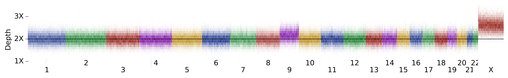
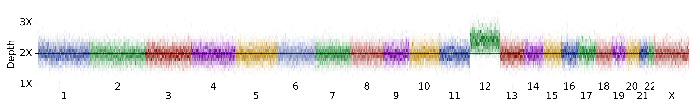

## Whole chromosome events

28 samples with full chromosome alteration:   

    HG00142  HG00189  HG00623  HG01137  HG01303  HG01357  HG01414  HG01506  
    HG01602  HG01702  HG01704  HG02322  HG02409  HG02485  HG02634  HG02651  
    HG02652  HG02805  HG03118  HG03796  HG03940  HG04198  HG04227  NA12156  
    NA19378  NA20348  NA20759  NA21143  

<h3>HG00142</h3>

<table border="0" class="dataframe">
  <thead>
    <tr style="text-align: right;">
      <th></th>
      <th>median</th>
      <th>mad</th>
      <th>z-score</th>
    </tr>
    <tr>
      <th>CHROM</th>
      <th></th>
      <th></th>
      <th></th>
    </tr>
  </thead>
  <tbody>
    <tr>
      <th>chr11</th>
      <td>130.4</td>
      <td>9.6</td>
      <td>169.4</td>
    </tr>
    <tr>
      <th>chr13</th>
      <td>129.6</td>
      <td>9.7</td>
      <td>144.9</td>
    </tr>
  </tbody>
</table>

<h3>HG00189</h3>

<table border="0" class="dataframe">
  <thead>
    <tr style="text-align: right;">
      <th></th>
      <th>median</th>
      <th>mad</th>
      <th>z-score</th>
    </tr>
    <tr>
      <th>CHROM</th>
      <th></th>
      <th></th>
      <th></th>
    </tr>
  </thead>
  <tbody>
    <tr>
      <th>chr9</th>
      <td>111.6</td>
      <td>9.1</td>
      <td>47.2</td>
    </tr>
  </tbody>
</table>

<h3>HG00623</h3>

<table border="0" class="dataframe">
  <thead>
    <tr style="text-align: right;">
      <th></th>
      <th>median</th>
      <th>mad</th>
      <th>z-score</th>
    </tr>
    <tr>
      <th>CHROM</th>
      <th></th>
      <th></th>
      <th></th>
    </tr>
  </thead>
  <tbody>
    <tr>
      <th>chr12</th>
      <td>133.3</td>
      <td>9.5</td>
      <td>84.7</td>
    </tr>
  </tbody>
</table>

<h3>HG01137</h3>

<table border="0" class="dataframe">
  <thead>
    <tr style="text-align: right;">
      <th></th>
      <th>median</th>
      <th>mad</th>
      <th>z-score</th>
    </tr>
    <tr>
      <th>CHROM</th>
      <th></th>
      <th></th>
      <th></th>
    </tr>
  </thead>
  <tbody>
    <tr>
      <th>chr12</th>
      <td>115.4</td>
      <td>9.0</td>
      <td>39.0</td>
    </tr>
  </tbody>
</table>

<h3>HG01303</h3>

<table border="0" class="dataframe">
  <thead>
    <tr style="text-align: right;">
      <th></th>
      <th>median</th>
      <th>mad</th>
      <th>z-score</th>
    </tr>
    <tr>
      <th>CHROM</th>
      <th></th>
      <th></th>
      <th></th>
    </tr>
  </thead>
  <tbody>
    <tr>
      <th>chr12</th>
      <td>119.1</td>
      <td>9.3</td>
      <td>48.4</td>
    </tr>
    <tr>
      <th>chr5</th>
      <td>119.1</td>
      <td>9.3</td>
      <td>142.4</td>
    </tr>
  </tbody>
</table>

<h3>HG01357</h3>

<table border="0" class="dataframe">
  <thead>
    <tr style="text-align: right;">
      <th></th>
      <th>median</th>
      <th>mad</th>
      <th>z-score</th>
    </tr>
    <tr>
      <th>CHROM</th>
      <th></th>
      <th></th>
      <th></th>
    </tr>
  </thead>
  <tbody>
    <tr>
      <th>chr12</th>
      <td>137.5</td>
      <td>10.4</td>
      <td>95.3</td>
    </tr>
  </tbody>
</table>

<h3>HG01414</h3>

<table border="0" class="dataframe">
  <thead>
    <tr style="text-align: right;">
      <th></th>
      <th>median</th>
      <th>mad</th>
      <th>z-score</th>
    </tr>
    <tr>
      <th>CHROM</th>
      <th></th>
      <th></th>
      <th></th>
    </tr>
  </thead>
  <tbody>
    <tr>
      <th>chr12</th>
      <td>106.8</td>
      <td>8.7</td>
      <td>12.0</td>
    </tr>
  </tbody>
</table>

<h3>HG01506</h3>

<table border="0" class="dataframe">
  <thead>
    <tr style="text-align: right;">
      <th></th>
      <th>median</th>
      <th>mad</th>
      <th>z-score</th>
    </tr>
    <tr>
      <th>CHROM</th>
      <th></th>
      <th></th>
      <th></th>
    </tr>
  </thead>
  <tbody>
    <tr>
      <th>chr11</th>
      <td>114.1</td>
      <td>8.9</td>
      <td>78.4</td>
    </tr>
  </tbody>
</table>

<h3>HG01602</h3>

<table border="0" class="dataframe">
  <thead>
    <tr style="text-align: right;">
      <th></th>
      <th>median</th>
      <th>mad</th>
      <th>z-score</th>
    </tr>
    <tr>
      <th>CHROM</th>
      <th></th>
      <th></th>
      <th></th>
    </tr>
  </thead>
  <tbody>
    <tr>
      <th>chr9</th>
      <td>130.5</td>
      <td>9.7</td>
      <td>123.8</td>
    </tr>
  </tbody>
</table>

<h3>HG01702</h3>

<table border="0" class="dataframe">
  <thead>
    <tr style="text-align: right;">
      <th></th>
      <th>median</th>
      <th>mad</th>
      <th>z-score</th>
    </tr>
    <tr>
      <th>CHROM</th>
      <th></th>
      <th></th>
      <th></th>
    </tr>
  </thead>
  <tbody>
    <tr>
      <th>chr12</th>
      <td>109.4</td>
      <td>9.1</td>
      <td>23.7</td>
    </tr>
  </tbody>
</table>

<h3>HG01704</h3>

<table border="0" class="dataframe">
  <thead>
    <tr style="text-align: right;">
      <th></th>
      <th>median</th>
      <th>mad</th>
      <th>z-score</th>
    </tr>
    <tr>
      <th>CHROM</th>
      <th></th>
      <th></th>
      <th></th>
    </tr>
  </thead>
  <tbody>
    <tr>
      <th>chr12</th>
      <td>106.2</td>
      <td>8.5</td>
      <td>8.8</td>
    </tr>
  </tbody>
</table>

<h3>HG02322</h3>

<table border="0" class="dataframe">
  <thead>
    <tr style="text-align: right;">
      <th></th>
      <th>median</th>
      <th>mad</th>
      <th>z-score</th>
    </tr>
    <tr>
      <th>CHROM</th>
      <th></th>
      <th></th>
      <th></th>
    </tr>
  </thead>
  <tbody>
    <tr>
      <th>chr12</th>
      <td>139.9</td>
      <td>10.4</td>
      <td>101.3</td>
    </tr>
  </tbody>
</table>

<h3>HG02409</h3>

<table border="0" class="dataframe">
  <thead>
    <tr style="text-align: right;">
      <th></th>
      <th>median</th>
      <th>mad</th>
      <th>z-score</th>
    </tr>
    <tr>
      <th>CHROM</th>
      <th></th>
      <th></th>
      <th></th>
    </tr>
  </thead>
  <tbody>
    <tr>
      <th>chr9</th>
      <td>109.2</td>
      <td>8.8</td>
      <td>37.6</td>
    </tr>
  </tbody>
</table>

<h3>HG02485</h3>

<table border="0" class="dataframe">
  <thead>
    <tr style="text-align: right;">
      <th></th>
      <th>median</th>
      <th>mad</th>
      <th>z-score</th>
    </tr>
    <tr>
      <th>CHROM</th>
      <th></th>
      <th></th>
      <th></th>
    </tr>
  </thead>
  <tbody>
    <tr>
      <th>chr12</th>
      <td>107.7</td>
      <td>8.8</td>
      <td>19.4</td>
    </tr>
  </tbody>
</table>

<h3>HG02634</h3>

<table border="0" class="dataframe">
  <thead>
    <tr style="text-align: right;">
      <th></th>
      <th>median</th>
      <th>mad</th>
      <th>z-score</th>
    </tr>
    <tr>
      <th>CHROM</th>
      <th></th>
      <th></th>
      <th></th>
    </tr>
  </thead>
  <tbody>
    <tr>
      <th>chr11</th>
      <td>120.0</td>
      <td>8.8</td>
      <td>111.2</td>
    </tr>
  </tbody>
</table>

<h3>HG02651</h3>

<table border="0" class="dataframe">
  <thead>
    <tr style="text-align: right;">
      <th></th>
      <th>median</th>
      <th>mad</th>
      <th>z-score</th>
    </tr>
    <tr>
      <th>CHROM</th>
      <th></th>
      <th></th>
      <th></th>
    </tr>
  </thead>
  <tbody>
    <tr>
      <th>chr12</th>
      <td>115.3</td>
      <td>9.2</td>
      <td>38.8</td>
    </tr>
  </tbody>
</table>

<h3>HG02652</h3>

<table border="0" class="dataframe">
  <thead>
    <tr style="text-align: right;">
      <th></th>
      <th>median</th>
      <th>mad</th>
      <th>z-score</th>
    </tr>
    <tr>
      <th>CHROM</th>
      <th></th>
      <th></th>
      <th></th>
    </tr>
  </thead>
  <tbody>
    <tr>
      <th>chr12</th>
      <td>109.7</td>
      <td>8.8</td>
      <td>24.4</td>
    </tr>
  </tbody>
</table>

<h3>HG02805</h3>

<table border="0" class="dataframe">
  <thead>
    <tr style="text-align: right;">
      <th></th>
      <th>median</th>
      <th>mad</th>
      <th>z-score</th>
    </tr>
    <tr>
      <th>CHROM</th>
      <th></th>
      <th></th>
      <th></th>
    </tr>
  </thead>
  <tbody>
    <tr>
      <th>chr9</th>
      <td>108.2</td>
      <td>8.9</td>
      <td>33.5</td>
    </tr>
  </tbody>
</table>

<h3>HG03118</h3>

<table border="0" class="dataframe">
  <thead>
    <tr style="text-align: right;">
      <th></th>
      <th>median</th>
      <th>mad</th>
      <th>z-score</th>
    </tr>
    <tr>
      <th>CHROM</th>
      <th></th>
      <th></th>
      <th></th>
    </tr>
  </thead>
  <tbody>
    <tr>
      <th>chr12</th>
      <td>108.2</td>
      <td>8.6</td>
      <td>20.6</td>
    </tr>
  </tbody>
</table>

<h3>HG03796</h3>

<table border="0" class="dataframe">
  <thead>
    <tr style="text-align: right;">
      <th></th>
      <th>median</th>
      <th>mad</th>
      <th>z-score</th>
    </tr>
    <tr>
      <th>CHROM</th>
      <th></th>
      <th></th>
      <th></th>
    </tr>
  </thead>
  <tbody>
    <tr>
      <th>chr12</th>
      <td>106.9</td>
      <td>8.9</td>
      <td>17.3</td>
    </tr>
  </tbody>
</table>

<h3>HG03940</h3>

<table border="0" class="dataframe">
  <thead>
    <tr style="text-align: right;">
      <th></th>
      <th>median</th>
      <th>mad</th>
      <th>z-score</th>
    </tr>
    <tr>
      <th>CHROM</th>
      <th></th>
      <th></th>
      <th></th>
    </tr>
  </thead>
  <tbody>
    <tr>
      <th>chr12</th>
      <td>111.2</td>
      <td>9.0</td>
      <td>28.4</td>
    </tr>
  </tbody>
</table>

<h3>HG04198</h3>

<table border="0" class="dataframe">
  <thead>
    <tr style="text-align: right;">
      <th></th>
      <th>median</th>
      <th>mad</th>
      <th>z-score</th>
    </tr>
    <tr>
      <th>CHROM</th>
      <th></th>
      <th></th>
      <th></th>
    </tr>
  </thead>
  <tbody>
    <tr>
      <th>chr12</th>
      <td>112.4</td>
      <td>8.2</td>
      <td>31.4</td>
    </tr>
  </tbody>
</table>

<h3>HG04227</h3>

<table border="0" class="dataframe">
  <thead>
    <tr style="text-align: right;">
      <th></th>
      <th>median</th>
      <th>mad</th>
      <th>z-score</th>
    </tr>
    <tr>
      <th>CHROM</th>
      <th></th>
      <th></th>
      <th></th>
    </tr>
  </thead>
  <tbody>
    <tr>
      <th>chr12</th>
      <td>106.4</td>
      <td>8.7</td>
      <td>8.8</td>
    </tr>
  </tbody>
</table>

<h3>NA12156</h3>

<table border="0" class="dataframe">
  <thead>
    <tr style="text-align: right;">
      <th></th>
      <th>median</th>
      <th>mad</th>
      <th>z-score</th>
    </tr>
    <tr>
      <th>CHROM</th>
      <th></th>
      <th></th>
      <th></th>
    </tr>
  </thead>
  <tbody>
    <tr>
      <th>chr9</th>
      <td>114.5</td>
      <td>8.4</td>
      <td>58.9</td>
    </tr>
  </tbody>
</table>

<h3>NA19378</h3>

<table border="0" class="dataframe">
  <thead>
    <tr style="text-align: right;">
      <th></th>
      <th>median</th>
      <th>mad</th>
      <th>z-score</th>
    </tr>
    <tr>
      <th>CHROM</th>
      <th></th>
      <th></th>
      <th></th>
    </tr>
  </thead>
  <tbody>
    <tr>
      <th>chr12</th>
      <td>120.3</td>
      <td>9.6</td>
      <td>51.4</td>
    </tr>
  </tbody>
</table>

<h3>NA20348</h3>

<table border="0" class="dataframe">
  <thead>
    <tr style="text-align: right;">
      <th></th>
      <th>median</th>
      <th>mad</th>
      <th>z-score</th>
    </tr>
    <tr>
      <th>CHROM</th>
      <th></th>
      <th></th>
      <th></th>
    </tr>
  </thead>
  <tbody>
    <tr>
      <th>chr12</th>
      <td>108.9</td>
      <td>8.7</td>
      <td>22.4</td>
    </tr>
  </tbody>
</table>

<h3>NA20759</h3>

<table border="0" class="dataframe">
  <thead>
    <tr style="text-align: right;">
      <th></th>
      <th>median</th>
      <th>mad</th>
      <th>z-score</th>
    </tr>
    <tr>
      <th>CHROM</th>
      <th></th>
      <th></th>
      <th></th>
    </tr>
  </thead>
  <tbody>
    <tr>
      <th>chr12</th>
      <td>124.9</td>
      <td>9.3</td>
      <td>63.1</td>
    </tr>
  </tbody>
</table>

<h3>NA21143</h3>

<table border="0" class="dataframe">
  <thead>
    <tr style="text-align: right;">
      <th></th>
      <th>median</th>
      <th>mad</th>
      <th>z-score</th>
    </tr>
    <tr>
      <th>CHROM</th>
      <th></th>
      <th></th>
      <th></th>
    </tr>
  </thead>
  <tbody>
    <tr>
      <th>chr12</th>
      <td>106.2</td>
      <td>8.1</td>
      <td>12.8</td>
    </tr>
    <tr>
      <th>chr14</th>
      <td>107.2</td>
      <td>8.1</td>
      <td>33.7</td>
    </tr>
    <tr>
      <th>chr9</th>
      <td>106.2</td>
      <td>8.0</td>
      <td>25.5</td>
    </tr>
  </tbody>
</table>

