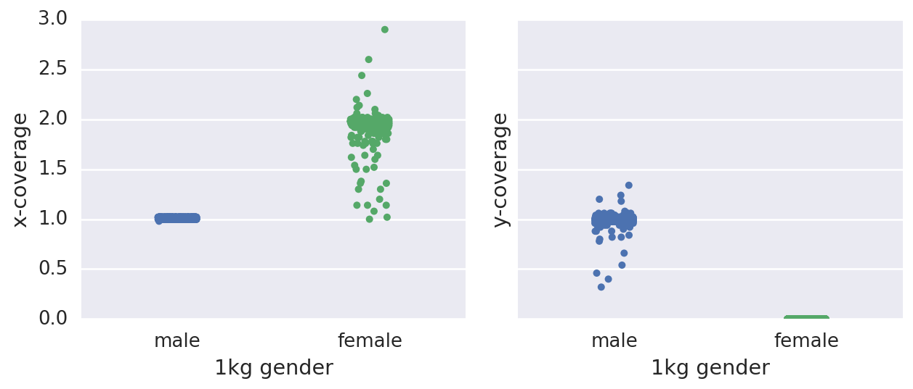

# Compile sample-level for ASHG talk

## Sample sex chromsome coverage

* Here the `1kg gender` column is the annotated gender on these samples from the 1000 genomes project FTP site. 

__file:__ [data/sex_chromosomes.csv](./data/sex_chromosomes.csv])

<h6>begining of file: </h6>

<table border="0" class="dataframe">
  <thead>
    <tr style="text-align: right;">
      <th></th>
      <th>1kg gender</th>
      <th>x-coverage</th>
      <th>y-coverage</th>
    </tr>
  </thead>
  <tbody>
    <tr>
      <th>HG00096</th>
      <td>male</td>
      <td>1.00</td>
      <td>0.98</td>
    </tr>
    <tr>
      <th>HG00097</th>
      <td>female</td>
      <td>1.98</td>
      <td>0.00</td>
    </tr>
    <tr>
      <th>HG00099</th>
      <td>female</td>
      <td>1.98</td>
      <td>0.00</td>
    </tr>
    <tr>
      <th>HG00100</th>
      <td>female</td>
      <td>1.98</td>
      <td>0.00</td>
    </tr>
    <tr>
      <th>HG00101</th>
      <td>male</td>
      <td>1.00</td>
      <td>1.00</td>
    </tr>
  </tbody>
</table>

<h6>distribution of X and Y coverage across samples: </h6>

<h6>7 male samples with y-chromosome dropout: </h6>

<table border="0" class="dataframe">
  <thead>
    <tr style="text-align: right;">
      <th></th>
      <th>1kg gender</th>
      <th>x-coverage</th>
      <th>y-coverage</th>
    </tr>
  </thead>
  <tbody>
    <tr>
      <th>HG00246</th>
      <td>male</td>
      <td>1.00</td>
      <td>0.32</td>
    </tr>
    <tr>
      <th>NA20754</th>
      <td>male</td>
      <td>1.02</td>
      <td>0.40</td>
    </tr>
    <tr>
      <th>HG01967</th>
      <td>male</td>
      <td>1.00</td>
      <td>0.46</td>
    </tr>
    <tr>
      <th>HG02053</th>
      <td>male</td>
      <td>1.00</td>
      <td>0.54</td>
    </tr>
    <tr>
      <th>HG03615</th>
      <td>male</td>
      <td>1.00</td>
      <td>0.66</td>
    </tr>
    <tr>
      <th>HG00185</th>
      <td>male</td>
      <td>1.02</td>
      <td>0.78</td>
    </tr>
    <tr>
      <th>HG03352</th>
      <td>male</td>
      <td>1.00</td>
      <td>0.80</td>
    </tr>
  </tbody>
</table>

 

<h6>3 male samples with mosaic y-chromosome gain: </h6>

<table border="0" class="dataframe">
  <thead>
    <tr style="text-align: right;">
      <th></th>
      <th>1kg gender</th>
      <th>x-coverage</th>
      <th>y-coverage</th>
    </tr>
  </thead>
  <tbody>
    <tr>
      <th>NA18966</th>
      <td>male</td>
      <td>1.02</td>
      <td>1.34</td>
    </tr>
    <tr>
      <th>NA11992</th>
      <td>male</td>
      <td>1.02</td>
      <td>1.24</td>
    </tr>
    <tr>
      <th>HG01882</th>
      <td>male</td>
      <td>1.00</td>
      <td>1.20</td>
    </tr>
  </tbody>
</table>

<h6>32 female samples with x-chromosome dropout: </h6>

<table border="0" class="dataframe">
  <thead>
    <tr style="text-align: right;">
      <th></th>
      <th>1kg gender</th>
      <th>x-coverage</th>
      <th>y-coverage</th>
    </tr>
  </thead>
  <tbody>
    <tr>
      <th>HG03511</th>
      <td>female</td>
      <td>1.00</td>
      <td>0.0</td>
    </tr>
    <tr>
      <th>NA19332</th>
      <td>female</td>
      <td>1.02</td>
      <td>0.0</td>
    </tr>
    <tr>
      <th>NA20506</th>
      <td>female</td>
      <td>1.08</td>
      <td>0.0</td>
    </tr>
    <tr>
      <th>HG00361</th>
      <td>female</td>
      <td>1.14</td>
      <td>0.0</td>
    </tr>
    <tr>
      <th>NA20530</th>
      <td>female</td>
      <td>1.14</td>
      <td>0.0</td>
    </tr>
    <tr>
      <th>NA19395</th>
      <td>female</td>
      <td>1.14</td>
      <td>0.0</td>
    </tr>
    <tr>
      <th>NA20533</th>
      <td>female</td>
      <td>1.20</td>
      <td>0.0</td>
    </tr>
    <tr>
      <th>HG01366</th>
      <td>female</td>
      <td>1.30</td>
      <td>0.0</td>
    </tr>
    <tr>
      <th>HG03019</th>
      <td>female</td>
      <td>1.30</td>
      <td>0.0</td>
    </tr>
    <tr>
      <th>HG00154</th>
      <td>female</td>
      <td>1.36</td>
      <td>0.0</td>
    </tr>
    <tr>
      <th>NA19054</th>
      <td>female</td>
      <td>1.36</td>
      <td>0.0</td>
    </tr>
    <tr>
      <th>HG04202</th>
      <td>female</td>
      <td>1.38</td>
      <td>0.0</td>
    </tr>
    <tr>
      <th>NA20832</th>
      <td>female</td>
      <td>1.50</td>
      <td>0.0</td>
    </tr>
    <tr>
      <th>NA18864</th>
      <td>female</td>
      <td>1.50</td>
      <td>0.0</td>
    </tr>
    <tr>
      <th>HG01137</th>
      <td>female</td>
      <td>1.52</td>
      <td>0.0</td>
    </tr>
    <tr>
      <th>NA18978</th>
      <td>female</td>
      <td>1.54</td>
      <td>0.0</td>
    </tr>
    <tr>
      <th>HG03055</th>
      <td>female</td>
      <td>1.60</td>
      <td>0.0</td>
    </tr>
    <tr>
      <th>NA20790</th>
      <td>female</td>
      <td>1.62</td>
      <td>0.0</td>
    </tr>
    <tr>
      <th>HG00732</th>
      <td>female</td>
      <td>1.64</td>
      <td>0.0</td>
    </tr>
    <tr>
      <th>NA18963</th>
      <td>female</td>
      <td>1.64</td>
      <td>0.0</td>
    </tr>
    <tr>
      <th>HG03401</th>
      <td>female</td>
      <td>1.70</td>
      <td>0.0</td>
    </tr>
    <tr>
      <th>HG02144</th>
      <td>female</td>
      <td>1.74</td>
      <td>0.0</td>
    </tr>
    <tr>
      <th>NA20769</th>
      <td>female</td>
      <td>1.76</td>
      <td>0.0</td>
    </tr>
    <tr>
      <th>HG00864</th>
      <td>female</td>
      <td>1.76</td>
      <td>0.0</td>
    </tr>
    <tr>
      <th>HG02652</th>
      <td>female</td>
      <td>1.76</td>
      <td>0.0</td>
    </tr>
    <tr>
      <th>NA18520</th>
      <td>female</td>
      <td>1.76</td>
      <td>0.0</td>
    </tr>
    <tr>
      <th>HG03016</th>
      <td>female</td>
      <td>1.76</td>
      <td>0.0</td>
    </tr>
    <tr>
      <th>NA11933</th>
      <td>female</td>
      <td>1.78</td>
      <td>0.0</td>
    </tr>
    <tr>
      <th>NA20535</th>
      <td>female</td>
      <td>1.78</td>
      <td>0.0</td>
    </tr>
    <tr>
      <th>HG01806</th>
      <td>female</td>
      <td>1.78</td>
      <td>0.0</td>
    </tr>
    <tr>
      <th>HG03634</th>
      <td>female</td>
      <td>1.80</td>
      <td>0.0</td>
    </tr>
    <tr>
      <th>NA20892</th>
      <td>female</td>
      <td>1.80</td>
      <td>0.0</td>
    </tr>
  </tbody>
</table>

 

<h6>5 female samples with x-chromosome gain: </h6>

<table border="0" class="dataframe">
  <thead>
    <tr style="text-align: right;">
      <th></th>
      <th>1kg gender</th>
      <th>x-coverage</th>
      <th>y-coverage</th>
    </tr>
  </thead>
  <tbody>
    <tr>
      <th>NA20821</th>
      <td>female</td>
      <td>2.90</td>
      <td>0.0</td>
    </tr>
    <tr>
      <th>HG02805</th>
      <td>female</td>
      <td>2.60</td>
      <td>0.0</td>
    </tr>
    <tr>
      <th>NA18946</th>
      <td>female</td>
      <td>2.44</td>
      <td>0.0</td>
    </tr>
    <tr>
      <th>HG02102</th>
      <td>female</td>
      <td>2.26</td>
      <td>0.0</td>
    </tr>
    <tr>
      <th>HG00261</th>
      <td>female</td>
      <td>2.20</td>
      <td>0.0</td>
    </tr>
  </tbody>
</table>

