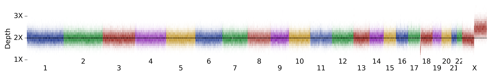

## Samples with x-chromosome gain

<h6>5 female samples with x-chromosome gain: </h6>

<table border="0" class="dataframe">
  <thead>
    <tr style="text-align: right;">
      <th></th>
      <th>1kg gender</th>
      <th>x-coverage</th>
      <th>y-coverage</th>
    </tr>
  </thead>
  <tbody>
    <tr>
      <th>NA20821</th>
      <td>female</td>
      <td>2.90</td>
      <td>0.0</td>
    </tr>
    <tr>
      <th>HG02805</th>
      <td>female</td>
      <td>2.60</td>
      <td>0.0</td>
    </tr>
    <tr>
      <th>NA18946</th>
      <td>female</td>
      <td>2.44</td>
      <td>0.0</td>
    </tr>
    <tr>
      <th>HG02102</th>
      <td>female</td>
      <td>2.26</td>
      <td>0.0</td>
    </tr>
    <tr>
      <th>HG00261</th>
      <td>female</td>
      <td>2.20</td>
      <td>0.0</td>
    </tr>
  </tbody>
</table>

<h3>NA20821</h3>

<table border="0" class="dataframe">
  <thead>
    <tr style="text-align: right;">
      <th></th>
      <th>1kg gender</th>
      <th>x-coverage</th>
      <th>y-coverage</th>
    </tr>
  </thead>
  <tbody>
    <tr>
      <th>NA20821</th>
      <td>female</td>
      <td>2.9</td>
      <td>0.0</td>
    </tr>
  </tbody>
</table>

<h3>HG02805</h3>

<table border="0" class="dataframe">
  <thead>
    <tr style="text-align: right;">
      <th></th>
      <th>1kg gender</th>
      <th>x-coverage</th>
      <th>y-coverage</th>
    </tr>
  </thead>
  <tbody>
    <tr>
      <th>HG02805</th>
      <td>female</td>
      <td>2.6</td>
      <td>0.0</td>
    </tr>
  </tbody>
</table>

<h3>NA18946</h3>

<table border="0" class="dataframe">
  <thead>
    <tr style="text-align: right;">
      <th></th>
      <th>1kg gender</th>
      <th>x-coverage</th>
      <th>y-coverage</th>
    </tr>
  </thead>
  <tbody>
    <tr>
      <th>NA18946</th>
      <td>female</td>
      <td>2.44</td>
      <td>0.0</td>
    </tr>
  </tbody>
</table>

<h3>HG02102</h3>

<table border="0" class="dataframe">
  <thead>
    <tr style="text-align: right;">
      <th></th>
      <th>1kg gender</th>
      <th>x-coverage</th>
      <th>y-coverage</th>
    </tr>
  </thead>
  <tbody>
    <tr>
      <th>HG02102</th>
      <td>female</td>
      <td>2.26</td>
      <td>0.0</td>
    </tr>
  </tbody>
</table>

<h3>HG00261</h3>

<table border="0" class="dataframe">
  <thead>
    <tr style="text-align: right;">
      <th></th>
      <th>1kg gender</th>
      <th>x-coverage</th>
      <th>y-coverage</th>
    </tr>
  </thead>
  <tbody>
    <tr>
      <th>HG00261</th>
      <td>female</td>
      <td>2.2</td>
      <td>0.0</td>
    </tr>
  </tbody>
</table>

