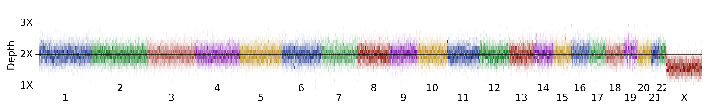

## Samples with x-chromosome loss

<h6>31 female samples with x-chromosome dropout: </h6>

<table border="0" class="dataframe">
  <thead>
    <tr style="text-align: right;">
      <th></th>
      <th>1kg gender</th>
      <th>x-coverage</th>
      <th>y-coverage</th>
    </tr>
  </thead>
  <tbody>
    <tr>
      <th>HG03511</th>
      <td>female</td>
      <td>1.00</td>
      <td>0.0</td>
    </tr>
    <tr>
      <th>NA19332</th>
      <td>female</td>
      <td>1.02</td>
      <td>0.0</td>
    </tr>
    <tr>
      <th>NA20506</th>
      <td>female</td>
      <td>1.08</td>
      <td>0.0</td>
    </tr>
    <tr>
      <th>HG00361</th>
      <td>female</td>
      <td>1.14</td>
      <td>0.0</td>
    </tr>
    <tr>
      <th>NA20530</th>
      <td>female</td>
      <td>1.14</td>
      <td>0.0</td>
    </tr>
    <tr>
      <th>NA19395</th>
      <td>female</td>
      <td>1.14</td>
      <td>0.0</td>
    </tr>
    <tr>
      <th>NA20533</th>
      <td>female</td>
      <td>1.20</td>
      <td>0.0</td>
    </tr>
    <tr>
      <th>HG01366</th>
      <td>female</td>
      <td>1.30</td>
      <td>0.0</td>
    </tr>
    <tr>
      <th>HG03019</th>
      <td>female</td>
      <td>1.30</td>
      <td>0.0</td>
    </tr>
    <tr>
      <th>HG00154</th>
      <td>female</td>
      <td>1.36</td>
      <td>0.0</td>
    </tr>
    <tr>
      <th>NA19054</th>
      <td>female</td>
      <td>1.36</td>
      <td>0.0</td>
    </tr>
    <tr>
      <th>HG04202</th>
      <td>female</td>
      <td>1.38</td>
      <td>0.0</td>
    </tr>
    <tr>
      <th>NA20832</th>
      <td>female</td>
      <td>1.50</td>
      <td>0.0</td>
    </tr>
    <tr>
      <th>NA18864</th>
      <td>female</td>
      <td>1.50</td>
      <td>0.0</td>
    </tr>
    <tr>
      <th>HG01137</th>
      <td>female</td>
      <td>1.52</td>
      <td>0.0</td>
    </tr>
    <tr>
      <th>NA18978</th>
      <td>female</td>
      <td>1.54</td>
      <td>0.0</td>
    </tr>
    <tr>
      <th>HG03055</th>
      <td>female</td>
      <td>1.60</td>
      <td>0.0</td>
    </tr>
    <tr>
      <th>NA20790</th>
      <td>female</td>
      <td>1.62</td>
      <td>0.0</td>
    </tr>
    <tr>
      <th>HG00732</th>
      <td>female</td>
      <td>1.64</td>
      <td>0.0</td>
    </tr>
    <tr>
      <th>NA18963</th>
      <td>female</td>
      <td>1.64</td>
      <td>0.0</td>
    </tr>
    <tr>
      <th>HG03401</th>
      <td>female</td>
      <td>1.70</td>
      <td>0.0</td>
    </tr>
    <tr>
      <th>HG02144</th>
      <td>female</td>
      <td>1.74</td>
      <td>0.0</td>
    </tr>
    <tr>
      <th>NA20769</th>
      <td>female</td>
      <td>1.76</td>
      <td>0.0</td>
    </tr>
    <tr>
      <th>HG00864</th>
      <td>female</td>
      <td>1.76</td>
      <td>0.0</td>
    </tr>
    <tr>
      <th>HG02652</th>
      <td>female</td>
      <td>1.76</td>
      <td>0.0</td>
    </tr>
    <tr>
      <th>NA18520</th>
      <td>female</td>
      <td>1.76</td>
      <td>0.0</td>
    </tr>
    <tr>
      <th>HG03016</th>
      <td>female</td>
      <td>1.76</td>
      <td>0.0</td>
    </tr>
    <tr>
      <th>NA11933</th>
      <td>female</td>
      <td>1.78</td>
      <td>0.0</td>
    </tr>
    <tr>
      <th>NA20535</th>
      <td>female</td>
      <td>1.78</td>
      <td>0.0</td>
    </tr>
    <tr>
      <th>HG01806</th>
      <td>female</td>
      <td>1.78</td>
      <td>0.0</td>
    </tr>
    <tr>
      <th>HG03634</th>
      <td>female</td>
      <td>1.80</td>
      <td>0.0</td>
    </tr>
    <tr>
      <th>NA20892</th>
      <td>female</td>
      <td>1.80</td>
      <td>0.0</td>
    </tr>
  </tbody>
</table>

<h3>HG03511</h3>

<table border="0" class="dataframe">
  <thead>
    <tr style="text-align: right;">
      <th></th>
      <th>1kg gender</th>
      <th>x-coverage</th>
      <th>y-coverage</th>
    </tr>
  </thead>
  <tbody>
    <tr>
      <th>HG03511</th>
      <td>female</td>
      <td>1.0</td>
      <td>0.0</td>
    </tr>
  </tbody>
</table>

<h3>NA19332</h3>

<table border="0" class="dataframe">
  <thead>
    <tr style="text-align: right;">
      <th></th>
      <th>1kg gender</th>
      <th>x-coverage</th>
      <th>y-coverage</th>
    </tr>
  </thead>
  <tbody>
    <tr>
      <th>NA19332</th>
      <td>female</td>
      <td>1.02</td>
      <td>0.0</td>
    </tr>
  </tbody>
</table>

<h3>NA20506</h3>

<table border="0" class="dataframe">
  <thead>
    <tr style="text-align: right;">
      <th></th>
      <th>1kg gender</th>
      <th>x-coverage</th>
      <th>y-coverage</th>
    </tr>
  </thead>
  <tbody>
    <tr>
      <th>NA20506</th>
      <td>female</td>
      <td>1.08</td>
      <td>0.0</td>
    </tr>
  </tbody>
</table>

<h3>HG00361</h3>

<table border="0" class="dataframe">
  <thead>
    <tr style="text-align: right;">
      <th></th>
      <th>1kg gender</th>
      <th>x-coverage</th>
      <th>y-coverage</th>
    </tr>
  </thead>
  <tbody>
    <tr>
      <th>HG00361</th>
      <td>female</td>
      <td>1.14</td>
      <td>0.0</td>
    </tr>
  </tbody>
</table>

<h3>NA20530</h3>

<table border="0" class="dataframe">
  <thead>
    <tr style="text-align: right;">
      <th></th>
      <th>1kg gender</th>
      <th>x-coverage</th>
      <th>y-coverage</th>
    </tr>
  </thead>
  <tbody>
    <tr>
      <th>NA20530</th>
      <td>female</td>
      <td>1.14</td>
      <td>0.0</td>
    </tr>
  </tbody>
</table>

<h3>NA19395</h3>

<table border="0" class="dataframe">
  <thead>
    <tr style="text-align: right;">
      <th></th>
      <th>1kg gender</th>
      <th>x-coverage</th>
      <th>y-coverage</th>
    </tr>
  </thead>
  <tbody>
    <tr>
      <th>NA19395</th>
      <td>female</td>
      <td>1.14</td>
      <td>0.0</td>
    </tr>
  </tbody>
</table>

<h3>NA20533</h3>

<table border="0" class="dataframe">
  <thead>
    <tr style="text-align: right;">
      <th></th>
      <th>1kg gender</th>
      <th>x-coverage</th>
      <th>y-coverage</th>
    </tr>
  </thead>
  <tbody>
    <tr>
      <th>NA20533</th>
      <td>female</td>
      <td>1.2</td>
      <td>0.0</td>
    </tr>
  </tbody>
</table>

<h3>HG01366</h3>

<table border="0" class="dataframe">
  <thead>
    <tr style="text-align: right;">
      <th></th>
      <th>1kg gender</th>
      <th>x-coverage</th>
      <th>y-coverage</th>
    </tr>
  </thead>
  <tbody>
    <tr>
      <th>HG01366</th>
      <td>female</td>
      <td>1.3</td>
      <td>0.0</td>
    </tr>
  </tbody>
</table>

<h3>HG03019</h3>

<table border="0" class="dataframe">
  <thead>
    <tr style="text-align: right;">
      <th></th>
      <th>1kg gender</th>
      <th>x-coverage</th>
      <th>y-coverage</th>
    </tr>
  </thead>
  <tbody>
    <tr>
      <th>HG03019</th>
      <td>female</td>
      <td>1.3</td>
      <td>0.0</td>
    </tr>
  </tbody>
</table>

<h3>HG00154</h3>

<table border="0" class="dataframe">
  <thead>
    <tr style="text-align: right;">
      <th></th>
      <th>1kg gender</th>
      <th>x-coverage</th>
      <th>y-coverage</th>
    </tr>
  </thead>
  <tbody>
    <tr>
      <th>HG00154</th>
      <td>female</td>
      <td>1.36</td>
      <td>0.0</td>
    </tr>
  </tbody>
</table>

<h3>NA19054</h3>

<table border="0" class="dataframe">
  <thead>
    <tr style="text-align: right;">
      <th></th>
      <th>1kg gender</th>
      <th>x-coverage</th>
      <th>y-coverage</th>
    </tr>
  </thead>
  <tbody>
    <tr>
      <th>NA19054</th>
      <td>female</td>
      <td>1.36</td>
      <td>0.0</td>
    </tr>
  </tbody>
</table>

<h3>HG04202</h3>

<table border="0" class="dataframe">
  <thead>
    <tr style="text-align: right;">
      <th></th>
      <th>1kg gender</th>
      <th>x-coverage</th>
      <th>y-coverage</th>
    </tr>
  </thead>
  <tbody>
    <tr>
      <th>HG04202</th>
      <td>female</td>
      <td>1.38</td>
      <td>0.0</td>
    </tr>
  </tbody>
</table>

<h3>NA20832</h3>

<table border="0" class="dataframe">
  <thead>
    <tr style="text-align: right;">
      <th></th>
      <th>1kg gender</th>
      <th>x-coverage</th>
      <th>y-coverage</th>
    </tr>
  </thead>
  <tbody>
    <tr>
      <th>NA20832</th>
      <td>female</td>
      <td>1.5</td>
      <td>0.0</td>
    </tr>
  </tbody>
</table>

<h3>NA18864</h3>

<table border="0" class="dataframe">
  <thead>
    <tr style="text-align: right;">
      <th></th>
      <th>1kg gender</th>
      <th>x-coverage</th>
      <th>y-coverage</th>
    </tr>
  </thead>
  <tbody>
    <tr>
      <th>NA18864</th>
      <td>female</td>
      <td>1.5</td>
      <td>0.0</td>
    </tr>
  </tbody>
</table>

<h3>HG01137</h3>

<table border="0" class="dataframe">
  <thead>
    <tr style="text-align: right;">
      <th></th>
      <th>1kg gender</th>
      <th>x-coverage</th>
      <th>y-coverage</th>
    </tr>
  </thead>
  <tbody>
    <tr>
      <th>HG01137</th>
      <td>female</td>
      <td>1.52</td>
      <td>0.0</td>
    </tr>
  </tbody>
</table>

<h3>NA18978</h3>

<table border="0" class="dataframe">
  <thead>
    <tr style="text-align: right;">
      <th></th>
      <th>1kg gender</th>
      <th>x-coverage</th>
      <th>y-coverage</th>
    </tr>
  </thead>
  <tbody>
    <tr>
      <th>NA18978</th>
      <td>female</td>
      <td>1.54</td>
      <td>0.0</td>
    </tr>
  </tbody>
</table>

<h3>HG03055</h3>

<table border="0" class="dataframe">
  <thead>
    <tr style="text-align: right;">
      <th></th>
      <th>1kg gender</th>
      <th>x-coverage</th>
      <th>y-coverage</th>
    </tr>
  </thead>
  <tbody>
    <tr>
      <th>HG03055</th>
      <td>female</td>
      <td>1.6</td>
      <td>0.0</td>
    </tr>
  </tbody>
</table>

<h3>NA20790</h3>

<table border="0" class="dataframe">
  <thead>
    <tr style="text-align: right;">
      <th></th>
      <th>1kg gender</th>
      <th>x-coverage</th>
      <th>y-coverage</th>
    </tr>
  </thead>
  <tbody>
    <tr>
      <th>NA20790</th>
      <td>female</td>
      <td>1.62</td>
      <td>0.0</td>
    </tr>
  </tbody>
</table>

<h3>HG00732</h3>

<table border="0" class="dataframe">
  <thead>
    <tr style="text-align: right;">
      <th></th>
      <th>1kg gender</th>
      <th>x-coverage</th>
      <th>y-coverage</th>
    </tr>
  </thead>
  <tbody>
    <tr>
      <th>HG00732</th>
      <td>female</td>
      <td>1.64</td>
      <td>0.0</td>
    </tr>
  </tbody>
</table>

<h3>NA18963</h3>

<table border="0" class="dataframe">
  <thead>
    <tr style="text-align: right;">
      <th></th>
      <th>1kg gender</th>
      <th>x-coverage</th>
      <th>y-coverage</th>
    </tr>
  </thead>
  <tbody>
    <tr>
      <th>NA18963</th>
      <td>female</td>
      <td>1.64</td>
      <td>0.0</td>
    </tr>
  </tbody>
</table>

<h3>HG03401</h3>

<table border="0" class="dataframe">
  <thead>
    <tr style="text-align: right;">
      <th></th>
      <th>1kg gender</th>
      <th>x-coverage</th>
      <th>y-coverage</th>
    </tr>
  </thead>
  <tbody>
    <tr>
      <th>HG03401</th>
      <td>female</td>
      <td>1.7</td>
      <td>0.0</td>
    </tr>
  </tbody>
</table>

<h3>HG02144</h3>

<table border="0" class="dataframe">
  <thead>
    <tr style="text-align: right;">
      <th></th>
      <th>1kg gender</th>
      <th>x-coverage</th>
      <th>y-coverage</th>
    </tr>
  </thead>
  <tbody>
    <tr>
      <th>HG02144</th>
      <td>female</td>
      <td>1.74</td>
      <td>0.0</td>
    </tr>
  </tbody>
</table>

<h3>NA20769</h3>

<table border="0" class="dataframe">
  <thead>
    <tr style="text-align: right;">
      <th></th>
      <th>1kg gender</th>
      <th>x-coverage</th>
      <th>y-coverage</th>
    </tr>
  </thead>
  <tbody>
    <tr>
      <th>NA20769</th>
      <td>female</td>
      <td>1.76</td>
      <td>0.0</td>
    </tr>
  </tbody>
</table>

<h3>HG00864</h3>

<table border="0" class="dataframe">
  <thead>
    <tr style="text-align: right;">
      <th></th>
      <th>1kg gender</th>
      <th>x-coverage</th>
      <th>y-coverage</th>
    </tr>
  </thead>
  <tbody>
    <tr>
      <th>HG00864</th>
      <td>female</td>
      <td>1.76</td>
      <td>0.0</td>
    </tr>
  </tbody>
</table>

<h3>HG02652</h3>

<table border="0" class="dataframe">
  <thead>
    <tr style="text-align: right;">
      <th></th>
      <th>1kg gender</th>
      <th>x-coverage</th>
      <th>y-coverage</th>
    </tr>
  </thead>
  <tbody>
    <tr>
      <th>HG02652</th>
      <td>female</td>
      <td>1.76</td>
      <td>0.0</td>
    </tr>
  </tbody>
</table>

<h3>NA18520</h3>

<table border="0" class="dataframe">
  <thead>
    <tr style="text-align: right;">
      <th></th>
      <th>1kg gender</th>
      <th>x-coverage</th>
      <th>y-coverage</th>
    </tr>
  </thead>
  <tbody>
    <tr>
      <th>NA18520</th>
      <td>female</td>
      <td>1.76</td>
      <td>0.0</td>
    </tr>
  </tbody>
</table>

<h3>HG03016</h3>

<table border="0" class="dataframe">
  <thead>
    <tr style="text-align: right;">
      <th></th>
      <th>1kg gender</th>
      <th>x-coverage</th>
      <th>y-coverage</th>
    </tr>
  </thead>
  <tbody>
    <tr>
      <th>HG03016</th>
      <td>female</td>
      <td>1.76</td>
      <td>0.0</td>
    </tr>
  </tbody>
</table>

<h3>NA11933</h3>

<table border="0" class="dataframe">
  <thead>
    <tr style="text-align: right;">
      <th></th>
      <th>1kg gender</th>
      <th>x-coverage</th>
      <th>y-coverage</th>
    </tr>
  </thead>
  <tbody>
    <tr>
      <th>NA11933</th>
      <td>female</td>
      <td>1.78</td>
      <td>0.0</td>
    </tr>
  </tbody>
</table>

<h3>NA20535</h3>

<table border="0" class="dataframe">
  <thead>
    <tr style="text-align: right;">
      <th></th>
      <th>1kg gender</th>
      <th>x-coverage</th>
      <th>y-coverage</th>
    </tr>
  </thead>
  <tbody>
    <tr>
      <th>NA20535</th>
      <td>female</td>
      <td>1.78</td>
      <td>0.0</td>
    </tr>
  </tbody>
</table>

<h3>HG01806</h3>

<table border="0" class="dataframe">
  <thead>
    <tr style="text-align: right;">
      <th></th>
      <th>1kg gender</th>
      <th>x-coverage</th>
      <th>y-coverage</th>
    </tr>
  </thead>
  <tbody>
    <tr>
      <th>HG01806</th>
      <td>female</td>
      <td>1.78</td>
      <td>0.0</td>
    </tr>
  </tbody>
</table>

<h3>HG03634</h3>

<table border="0" class="dataframe">
  <thead>
    <tr style="text-align: right;">
      <th></th>
      <th>1kg gender</th>
      <th>x-coverage</th>
      <th>y-coverage</th>
    </tr>
  </thead>
  <tbody>
    <tr>
      <th>HG03634</th>
      <td>female</td>
      <td>1.8</td>
      <td>0.0</td>
    </tr>
  </tbody>
</table>

<h3>NA20892</h3>

<table border="0" class="dataframe">
  <thead>
    <tr style="text-align: right;">
      <th></th>
      <th>1kg gender</th>
      <th>x-coverage</th>
      <th>y-coverage</th>
    </tr>
  </thead>
  <tbody>
    <tr>
      <th>NA20892</th>
      <td>female</td>
      <td>1.8</td>
      <td>0.0</td>
    </tr>
  </tbody>
</table>

