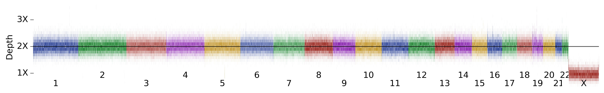
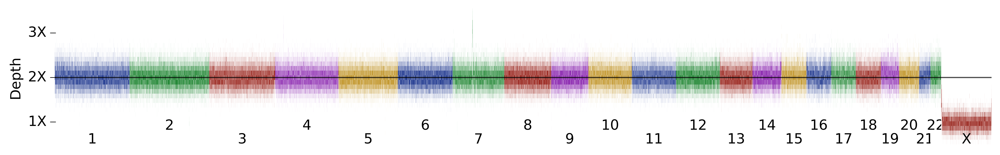
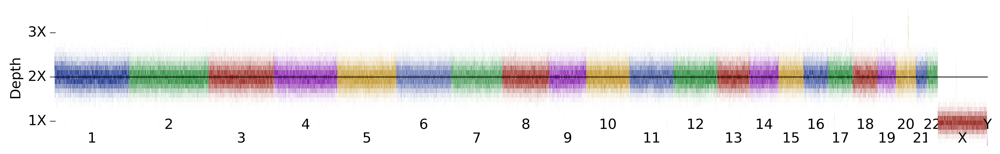
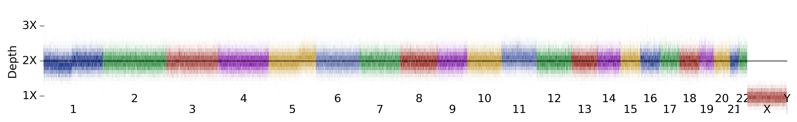
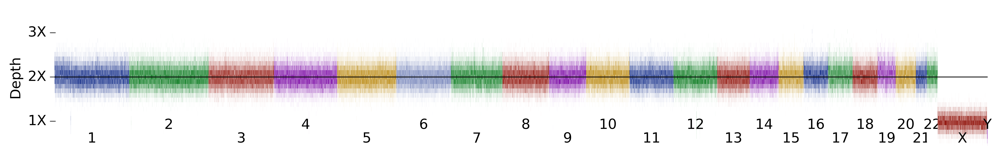
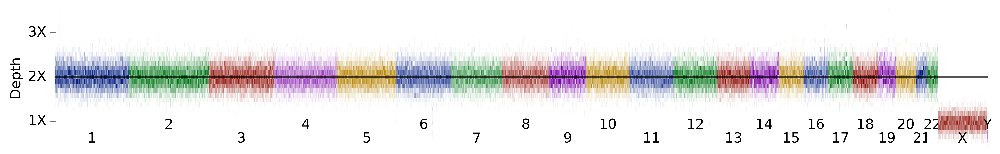

## Samples with y-chromosome dropout  
<i>These y-chromosome changes are a bit hard to see on the plots.</i>

<h6>7 male samples with y-chromosome dropout: </h6>

<table border="0" class="dataframe">
  <thead>
    <tr style="text-align: right;">
      <th></th>
      <th>1kg gender</th>
      <th>x-coverage</th>
      <th>y-coverage</th>
    </tr>
  </thead>
  <tbody>
    <tr>
      <th>HG00246</th>
      <td>male</td>
      <td>1.00</td>
      <td>0.32</td>
    </tr>
    <tr>
      <th>NA20754</th>
      <td>male</td>
      <td>1.02</td>
      <td>0.40</td>
    </tr>
    <tr>
      <th>HG01967</th>
      <td>male</td>
      <td>1.00</td>
      <td>0.46</td>
    </tr>
    <tr>
      <th>HG02053</th>
      <td>male</td>
      <td>1.00</td>
      <td>0.54</td>
    </tr>
    <tr>
      <th>HG03615</th>
      <td>male</td>
      <td>1.00</td>
      <td>0.66</td>
    </tr>
    <tr>
      <th>HG00185</th>
      <td>male</td>
      <td>1.02</td>
      <td>0.78</td>
    </tr>
    <tr>
      <th>HG03352</th>
      <td>male</td>
      <td>1.00</td>
      <td>0.80</td>
    </tr>
  </tbody>
</table>

<h3>HG00246</h3>

<table border="0" class="dataframe">
  <thead>
    <tr style="text-align: right;">
      <th></th>
      <th>1kg gender</th>
      <th>x-coverage</th>
      <th>y-coverage</th>
    </tr>
  </thead>
  <tbody>
    <tr>
      <th>HG00246</th>
      <td>male</td>
      <td>1.0</td>
      <td>0.32</td>
    </tr>
  </tbody>
</table>

<h3>NA20754</h3>

<table border="0" class="dataframe">
  <thead>
    <tr style="text-align: right;">
      <th></th>
      <th>1kg gender</th>
      <th>x-coverage</th>
      <th>y-coverage</th>
    </tr>
  </thead>
  <tbody>
    <tr>
      <th>NA20754</th>
      <td>male</td>
      <td>1.02</td>
      <td>0.4</td>
    </tr>
  </tbody>
</table>

<h3>HG01967</h3>

<table border="0" class="dataframe">
  <thead>
    <tr style="text-align: right;">
      <th></th>
      <th>1kg gender</th>
      <th>x-coverage</th>
      <th>y-coverage</th>
    </tr>
  </thead>
  <tbody>
    <tr>
      <th>HG01967</th>
      <td>male</td>
      <td>1.0</td>
      <td>0.46</td>
    </tr>
  </tbody>
</table>

<h3>HG02053</h3>

<table border="0" class="dataframe">
  <thead>
    <tr style="text-align: right;">
      <th></th>
      <th>1kg gender</th>
      <th>x-coverage</th>
      <th>y-coverage</th>
    </tr>
  </thead>
  <tbody>
    <tr>
      <th>HG02053</th>
      <td>male</td>
      <td>1.0</td>
      <td>0.54</td>
    </tr>
  </tbody>
</table>

<h3>HG03615</h3>

<table border="0" class="dataframe">
  <thead>
    <tr style="text-align: right;">
      <th></th>
      <th>1kg gender</th>
      <th>x-coverage</th>
      <th>y-coverage</th>
    </tr>
  </thead>
  <tbody>
    <tr>
      <th>HG03615</th>
      <td>male</td>
      <td>1.0</td>
      <td>0.66</td>
    </tr>
  </tbody>
</table>

<h3>HG00185</h3>

<table border="0" class="dataframe">
  <thead>
    <tr style="text-align: right;">
      <th></th>
      <th>1kg gender</th>
      <th>x-coverage</th>
      <th>y-coverage</th>
    </tr>
  </thead>
  <tbody>
    <tr>
      <th>HG00185</th>
      <td>male</td>
      <td>1.02</td>
      <td>0.78</td>
    </tr>
  </tbody>
</table>

<h3>HG03352</h3>

<table border="0" class="dataframe">
  <thead>
    <tr style="text-align: right;">
      <th></th>
      <th>1kg gender</th>
      <th>x-coverage</th>
      <th>y-coverage</th>
    </tr>
  </thead>
  <tbody>
    <tr>
      <th>HG03352</th>
      <td>male</td>
      <td>1.0</td>
      <td>0.8</td>
    </tr>
  </tbody>
</table>

