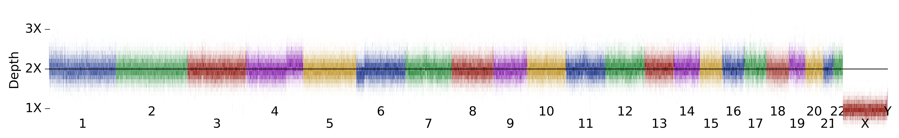

## Samples with y-chromosome gain  
<i>These y-chromosome changes are a bit hard to see on the plots.</i>

<h6>3 male samples with mosaic y-chromosome gain: </h6>

<table border="0" class="dataframe">
  <thead>
    <tr style="text-align: right;">
      <th></th>
      <th>1kg gender</th>
      <th>x-coverage</th>
      <th>y-coverage</th>
    </tr>
  </thead>
  <tbody>
    <tr>
      <th>NA18966</th>
      <td>male</td>
      <td>1.02</td>
      <td>1.34</td>
    </tr>
    <tr>
      <th>NA11992</th>
      <td>male</td>
      <td>1.02</td>
      <td>1.24</td>
    </tr>
    <tr>
      <th>HG01882</th>
      <td>male</td>
      <td>1.00</td>
      <td>1.20</td>
    </tr>
  </tbody>
</table>

<h3>NA18966</h3>

<table border="0" class="dataframe">
  <thead>
    <tr style="text-align: right;">
      <th></th>
      <th>1kg gender</th>
      <th>x-coverage</th>
      <th>y-coverage</th>
    </tr>
  </thead>
  <tbody>
    <tr>
      <th>NA18966</th>
      <td>male</td>
      <td>1.02</td>
      <td>1.34</td>
    </tr>
  </tbody>
</table>

<h3>NA11992</h3>

<table border="0" class="dataframe">
  <thead>
    <tr style="text-align: right;">
      <th></th>
      <th>1kg gender</th>
      <th>x-coverage</th>
      <th>y-coverage</th>
    </tr>
  </thead>
  <tbody>
    <tr>
      <th>NA11992</th>
      <td>male</td>
      <td>1.02</td>
      <td>1.24</td>
    </tr>
  </tbody>
</table>

<h3>HG01882</h3>

<table border="0" class="dataframe">
  <thead>
    <tr style="text-align: right;">
      <th></th>
      <th>1kg gender</th>
      <th>x-coverage</th>
      <th>y-coverage</th>
    </tr>
  </thead>
  <tbody>
    <tr>
      <th>HG01882</th>
      <td>male</td>
      <td>1.0</td>
      <td>1.2</td>
    </tr>
  </tbody>
</table>

