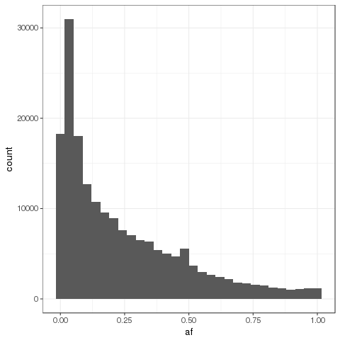
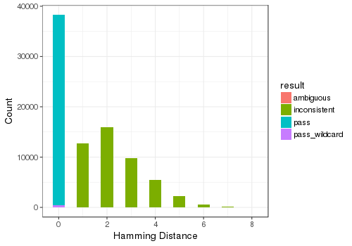
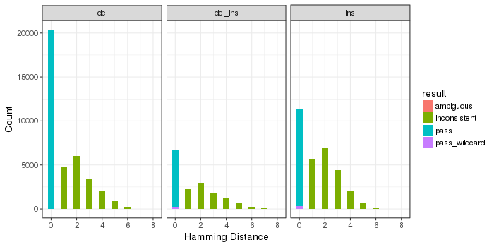
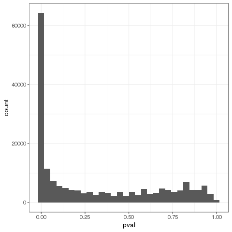
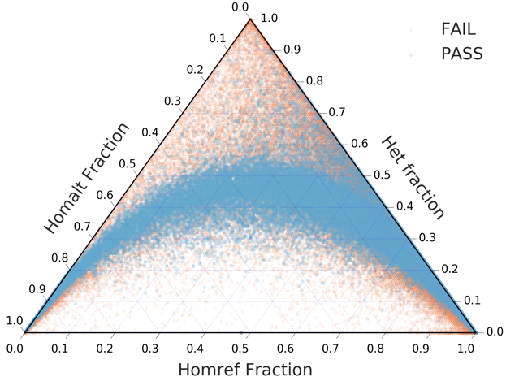

[TOC]: #

# Table of Contents
- [Get the data](#get-the-data)
- [Input sources](#input-sources)
- [Populations used](#populations-used)
- [Software used](#software-used)
- [Dataset summary](#dataset-summary)
    - [Allele frequency](#allele-frequency)
- [Validation results](#validation-results)
    - [Validation methods](#validation-methods)
    - [Pedigree consistency](#pedigree-consistency)
    - [HWE](#hwe)
- [References](#references)


## Get the data

The easiest way to get the VC1.0 VCF is to use wget to download the data from
the `illumina-polaris` AWS S3 bucket:

```bash
$: wget https://s3.amazonaws.com/illumina-polaris/vc1_0.vcf.gz
$: wget https://s3.amazonaws.com/illumina-polaris/vc1_0.vcf.gz.tbi
```

## Input sources

VC1.0 candidate SV calls were derived from 3 sources:

| Data source                                                 | SV type  | # candidates |
|:------------------------------------------------------------|:---------|-------------:|
| [Pop-Manta][1.1]                                            | DEL, INS |      174,532 |
| [PG-pop][1.2]                                               | DEL      |        9,740 |
| [Parliament insertions][1.3]<sup>[1](#English2015)</sup>    | INS      |          233 |
| [PopIns Icelandic insertions][1.4]<sup>[2](#Kehr2017)</sup> | INS      |          483 |
| **Total**                                                   | DEL, INS |  **184,988** |

Of these candidate loci, **183,098** were bi-allelic in at least one sample in
this release.

## Populations used

VC1.0 candidate calls were evaluated on 243 samples from:
* [HiSeqX Diversity Panel][2.1]
* [HiSeqX PGx Panel][2.2]
* [HiSeq2000 Platinum Genomes pedigree][2.3]
* [HiSeqX Platinum Genomes parents and grandparents][2.4]

Variants are reported for 221 individuals, including NA12878, NA12877, the
entire Diversity Panel, and 69 members of the PGx panel (excluding NA18942).

## Software used

| Process                            | Tool        |     Version |
|:-----------------------------------|:------------|------------:|
| Graph realignment  & joint calling | `paragraph` | pre-release |

## Dataset summary

### Allele frequency

The allele frequency distribution is as expected &mdash; there are more rare SVs
than common SVs. Most SVs have minor allele frequencies (MAFs) greater than 5%.



## Validation results

### Validation methods

Calls were validated using:
* Platinum Genomes pedigree consistency
* Diversity / PGx panel HWE

### Pedigree consistency

Consistency status within the Platinum Genomes pedigree was as follows:

| Status                |  Count | Percent |
|:----------------------|-------:|--------:|
| Pedigree consistent   | 37,792 |  54.01% |
| Uniformly homozygous  | 99,909 |  20.43% |
| Pedigree inconsistent | 46,578 |  25.18% |
| Other                 |    709 |   0.38% |



When considering all variant types that could be assessed for pedigree
consistency. the Hamming distances for pedigree inconsistent loci was generally
&le; 3. This suggests that most of these failing calls were incorrectly
genotyped at a few members within the pedigree but might be recovered with
improved genotyping methods.



When breaking down performance by variant type, we see that in general, more
pedigree-consistent calls were derived from deletion candidates than insertion
candidates. The observation that few loci seem to have extensive genotyping
errors within the pedigree holds.

As described [in the wiki][3.1.1], we cannot assess the consistency status of
variants that are uniformly homozygous within the pedigree.

### HWE

Loci with MAF &gt; 5% and chi-squared test p-value &ge; 0.05 were considered to
be in HWE. **71,505** total loci satisfied these criteria.

We chose the MAF cutoff to ensure that we had a sufficient number of samples to
observe heterozygous and homozygous alternate individuals within the population
if HWE held. While the p-value cutoff is conservative, we felt that this was the
right choice for our initial dataset release.

The p-value distribution indicates that many of these loci *do not* satisfy our
HWE criteria:



Loci may not be in HWE for two reasons:
1. `paragraph` genotyping errors
2. Insufficient genotype observations (likely due to low MAF)

When we evaluate the HWE ternary plot, we do see an enrichment of alleles with
low MAF (lower right corner of the triangle) that are not in HWE, which
substantiates option 2. These loci may be in HWE in a larger or more uniform
population.



We expect that as our joint calling methods improve, we will see more loci
satisfy our HWE requirements, provided there are no other factors causing
deviation from HWE.

## References

1. <a name="English2015"></a>English, et al (2015) Assessing structural
   variation in a personal genome-towards a human reference diploid genome. *BMC
   Genomics.* 16:286 [doi:10.1186/s12864-015-1479-3][6.2]
2. <a name="Kehr2017"></a>Kehr, et al (2017) Diversity in non-repetitive human
   sequences not found in the reference genome. *Nat Genet.* 49(4):588-593.
   [doi: 10.1038/ng.3801][6.1]

[1.1]: ../../../wiki/Input-Data-Sources#pop-manta
[1.2]: ../../../wiki/Input-Data-Sources#pg-pop
[1.3]: ../../../wiki/Input-Data-Sources#parliament-insertions
[1.4]: ../../../wiki/Input-Data-Sources#popins-icelandic-insertions
[2.1]: ../../../wiki/HiSeqX-Diversity-Panel
[2.2]: ../../../wiki/HiSeqX-PGx-Panel
[2.3]: ../../../wiki/Sample-Information#pg-hiseq2000
[2.4]: ../../../wiki/Sample-Information#pg-hiseqx
[3.1.1]: ../../../wiki/Validation-Methods#unassessable-loci
[6.1]: https://www.nature.com/ng/journal/v49/n4/full/ng.3801.html
[6.2]: https://bmcgenomics.biomedcentral.com/articles/10.1186/s12864-015-1479-3
